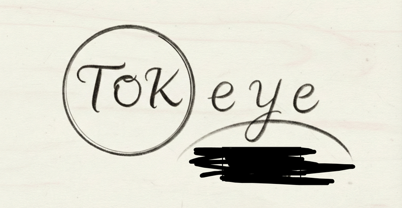

<p align="center">
  
</p>

# TokEye

[](https://github.com/PlasmaControl/tokeye/actions/workflows/python-package.yml)

TokEye is a open-source Python-based application for automatic classification and localization of fluctuating signals.
It is designed to be used in the context of plasma physics, but can be used for any type of fluctuating signal.

Check out [this poster from APS DPP 2025](assets/aps_dpp_2025.pdf) or [this preprint](https://arxiv.org/abs/2602.20317) for more information.

## Example Demonstration
<video src="https://github.com/user-attachments/assets/03560db6-1941-483e-b9d7-706c164833f7" autoplay loop muted playsinline controls width="100%"></video>

Expected processing time:
- V100: < 0.5 seconds on any size spectrogram after warmup.
- CPU: ~5-10 seconds.

## Quickstart

```bash
pip install tokeye   # or: uv tool install tokeye
tokeye app           # opens web app on http://localhost:7860
```

- The default model downloads automatically from Hugging Face on first use (~30 MB, cached — no manual setup).
- No data on hand? Click "Load Example Signal" in the app, or generate one from the shell with `tokeye example`.
- `pip install` requires Python >= 3.13; `uvx`/`uv tool install` fetch a compatible Python automatically.

Zero-install trial: `uvx tokeye app` runs the app without installing anything into your environment.

## Python API

To use TokEye inside your own program, import the `TokEye` class and call it — no configuration needed:

```python
import numpy as np
from tokeye import TokEye

eye = TokEye()  # loads the default model (auto-downloads on first use)

mask = eye(signal)             # 1D time series → STFT → inference
mask = eye(spectrogram)        # 2D spectrogram → inference directly
coherent, transient = mask     # (2, H, W) sigmoid scores in [0, 1]
```

Input is auto-detected by shape: a 1D array is treated as a raw time series (TokEye computes the spectrogram), a 2D array as a ready spectrogram. Standardization happens internally — no preprocessing needed.

If your 2D spectrogram is stored in **linear scale** (raw STFT magnitude/power), pass `log=True` so TokEye applies `log1p` first — the model expects log-scaled input:

```python
mask = eye(linear_spectrogram, log=True)      # per call
eye = TokEye(log=True)                        # or for every call
```

`log` is off by default and ignored for 1D inputs (the STFT already log-scales). Everything is configurable through the constructor, but the defaults just work:

```python
eye = TokEye(
    model="big_tf_unet",   # registry name or path to a local .pt/.pt2
    device="auto",         # "cpu", "cuda", or "auto"
    n_fft=1024, hop=256,   # STFT settings (1D inputs only)
    clip_dc=True, clip_low=1.0, clip_high=99.0,
    log=False,             # log1p for linear-scale 2D spectrograms
)
```

## Batch processing (CLI)

For headless / scripted use (no browser needed), run inference directly. For example:

```bash
tokeye run "files/*.npy" --output-dir results
```

`INPUT` arguments can be files, directories (all `*.npy` files inside are used), or quoted glob patterns. Each input is interpreted by its shape:
- **1D array** — a raw time series. TokEye computes its STFT spectrogram using the flags below before running inference.
- **2D array** — a precomputed spectrogram, fed to the model directly.

For each input file, `tokeye run` writes:
- `<stem>_mask.npy` — float32 array, shape `(2, H, W)`, sigmoid scores per pixel (channel 0 = coherent, channel 1 = transient).
- `<stem>_preview.png` — a grayscale spectrogram with the mask overlaid (green = coherent, red = transient), unless `--no-png` is passed.

The process exit code is the number of files that failed.

Flags:
| Flag | Default | Description |
| --- | --- | --- |
| `--model` | `big_tf_unet` | Registry name or path to a `.pt`/`.pt2` checkpoint. |
| `--output-dir` | `tokeye_output` | Directory for masks and previews. |
| `--n-fft` | `1024` | STFT window size (1D inputs only). |
| `--hop` | `256` | STFT hop size (1D inputs only). |
| `--keep-dc` | off | Keep the DC bin (dropped by default). |
| `--clip-low` / `--clip-high` | `1.0` / `99.0` | Percentile clip bounds applied to the spectrogram. |
| `--log` | off | Apply `log1p` to 2D spectrogram inputs stored in linear scale (1D signals are always log-scaled during the STFT). |
| `--threshold` | `0.5` | Mask threshold used only for the preview PNG overlay. |
| `--no-png` | off | Skip preview PNGs; write masks only. |
| `--device` | `auto` | `cpu`, `cuda`, or `auto`. |

The released model was trained on spectrograms built with hop=128; for closest match to the training configuration use `--hop 128`.

On HPC clusters where compute nodes have no internet access, pre-fetch the weights on the login node, then run the batch job on the compute node:

```bash
tokeye download big_tf_unet   # on the login node; prints the cached path
tokeye run ... --model big_tf_unet   # on the compute node — model is already cached
```

## Mode-analysis suite

Beyond segmentation, `tokeye` bundles the analyses DIII-D researchers usually reach for separate tools to get. Each is a subcommand; `--help` on any of them shows the full flags.

| Command | What it does |
| --- | --- |
| `tokeye modespec <config.yaml>` | Classic Mirnov mode analysis (vendored [pymodespec](src/tokeye/modespec/classic/PROVENANCE.md), the Python port of the IDL `modespec` tool): power spectrograms, matched-filter toroidal mode-number fits, per-shot mode CSVs. Data fetch needs MDSplus (GA cluster / conda-forge) or a local cache; an example config ships at `src/tokeye/modespec/classic/modes.yaml`. |
| `tokeye elmspec INPUTS...` | ELM detection from the segmentation model's transient channel: per-event time intervals plus per-shot count, ELM frequency (with `--fs`), and duty cycle, written to `elm_events.csv` / `elm_summary.csv`. |
| `tokeye alfvenspec INPUTS...` | Alfvén-eigenmode detection with the `ae_tf_maskrcnn` instance model: per-detection boxes/scores (`ae_detections.csv`) and instance masks. Wide spectrograms are processed in training-width windows automatically. |
| `tokeye eigspec [SCRIPT]` | Interactive modal identification and spectral analysis (vendored [eigspec](src/tokeye/eigspec/PROVENANCE.md), the Python port of the MATLAB toolbox): stochastic subspace ID, AR/PCA, random-projection spectral analysis, clustering (clustering needs `pip install tokeye[eigspec]`). |
| `tokeye modesearch` | Design stage — prints the plan for a searchable database of detected modes. |

The suite roadmap (including the next-generation `modespec --engine deep`) lives in [docs/ROADMAP.md](docs/ROADMAP.md).

## Web app guide

`tokeye app` (or `python -m tokeye.app`) launches a Gradio interface with three tabs:
- **Analyze** — load a signal, compute its spectrogram, run a model, and visualize the result. Guided for first-time use: the model dropdown defaults to the bundled `big_tf_unet` model, the STFT transform has working defaults, and "Load Example Signal" generates a synthetic demo signal so a brand-new user needs zero files. "Analyze" runs the whole load-model → infer → visualize pipeline in one click. View modes: Original, Enhanced (percentile-clipped amplitude), Mask (thresholded model output), Amplitude.
- **Annotate** — manually draw and save mask annotations over a read-only backdrop image.
- **Utilities** — audio-format conversion and `.npy` file inspection.

Flags: `tokeye app [--port 7860] [--share] [--open]` — `--share` creates a public Gradio link, `--open` opens a browser tab on launch.

If you're on a remote server (e.g. an HPC login node), forward the port over SSH instead of using `--share`:
```bash
ssh -L 7860:localhost:7860 user@remote
```
Then open `http://localhost:7860` in your local browser.

## Verified Datatypes
- DIII-D Fast Magnetics (cite)
- DIII-D CO2 Interferometer (cite)
- DIII-D Electron Cyclotron Emission (cite)
- DIII-D Beam Emission Spectroscopy (cite)

## Evaluation
Recall Scores:
- TJII2021: 0.8254
- DCLDE2011 (Delphinus capensis): 0.7708
- DCLDE2011 (Delphinus delphis): 0.7953

With more data, comes better models. Please contribute to the project!

## Installation (from source / development)

[uv](https://docs.astral.sh/uv/) is the dev tool for this repo:
```bash
git clone git@github.com:PlasmaControl/TokEye.git
cd TokEye
uv sync             # core deps
uv sync --dev       # + pytest, ruff, etc.
uv sync --group train  # + training deps (lightning, h5py, etc.)
```

This creates a `.venv/`; activate it with `source .venv/bin/activate`, or prefix commands with `uv run`.

## Models

| Registry name | HF repo | HF file | Description |
| --- | --- | --- | --- |
| `big_tf_unet` | [`nc1/big_tf_unet`](https://huggingface.co/nc1/big_tf_unet) | `big_tf_unet_251210.pt` | Transformer U-Net trained on multiscale (multiwindow, multihop) spectrograms. |
| `ae_tf_maskrcnn` | `nc1/ae_tf_maskrcnn` | `ae_tf_maskrcnn_251223.pt` | Mask R-CNN instance detector for Alfvén-eigenmode activity (used by `tokeye alfvenspec`). |

Weights download automatically the first time a registry name is used (cached in `~/.cache/huggingface`). Override the default repo with the `TOKEYE_HF_REPO` environment variable (per-model repos are fixed in the registry).

To use a local checkpoint instead, put `.pt`/`.pt2` files in a `model/` directory (picked up by the app's model dropdown) or pass a path directly via `--model PATH`.

Input should be a tensor that has shape (B, 1, H, W) where B, H, and W can vary
Output will be a tensor of shape (B, 2, H, W)

Best performance when spectrograms are oriented so that when they are plotted with matplotlib, the lowest frequency bin is oriented with the bottom when `origin='lower'`. Spectrograms should be standardized (mean = 0, std = 1). If baseline activity is very strong, clipping the input may help, but is generally not needed.

The first channel of the output will return preferential measurements of coherent activity (useful for most tasks)
The second channel of the output will return preferential measurements of transient activity

## Data
Keep signals as 1D numpy float arrays (raw time series) — no need to normalize or preprocess them. The CLI also accepts 2D arrays (precomputed spectrograms) directly. The app scans a signal directory for `.npy` files (default `data/input`, configurable in the Analyze tab).

Bringing your own data takes two lines:

```python
import numpy as np

signal = ...  # any 1D float array: tokamak diagnostic, hydrophone, etc.
np.save("shots/myshot.npy", signal)
```

```bash
tokeye run shots/myshot.npy --output-dir results
```

No data yet? `tokeye example` writes a synthetic demo signal you can run immediately, and the web app has a matching "Load Example Signal" button.

## Development

```bash
uv sync --dev
uv run ruff check .
uv run pytest
```

## Citation
If you use this code in your research, please cite:
```bibtex
@article{chen_TokEye_2026,
  title={TokEye: Fast Signal Extraction for Fluctuating Time Series via Offline Self-Supervised Learning From Fusion Diagnostics to Bioacoustics},
  author={Chen, Nathaniel},
  year={2026},
  publisher={ArXiv},
  doi={10.48550/arXiv.2602.20317},
  url={https://www.arxiv.org/abs/2602.20317}
}
```

## Contact
Nathaniel Chen — nathaniel [at] princeton [dot] edu — https://nathanielchen.net
